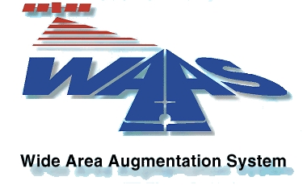

class: inverse
layout: true

Introduction to GPS/WAAS

---

# GPS / WAAS Introduction
.center[]

---

# Questions to Ponder and Answer

* Why yet another navigation system?
    * What are the benefits over other systems?
* What is WAAS?
* Why can't we just use GPS?
* What does WAAS do, really?
* How does WAAS work?
* Where is WAAS used?

---

# Why GPS and WAAS?

.center[]

???

* **Primary Means of Navigation** - Takeoff, Enroute, Approach and Landing
* **More Direct Routes** - Not Restricted by Location of Ground-Based Navigation Equipment
* **Approach with Vertical Guidance Capability** at Any Qualified U.S. Airport
* **Decommission of Older, Expensive Ground-Based Navigation Equipment** - Reduced Maintenance Costs
* **Simplify and Reduce Equipment on Board Aircraft**
* **Increase Capacity** - Reduced Separation Due to Improved Accuracy

---

# Why GPS and WAAS?
* Victor airways are not direct

.center[]

---

# Why GPS and WAAS?

.center[]

---

# Kodiak, Alaska
Runway 25 Centerline (from Alaska Air)

.center[]

Decision Height Determined by Missed Approach Missed Approach Is Climbing Left Hand Turn

---

# Why GPS and WAAS?

.center[]

---

# Kotzebue, VOR
.center[]

---

# Why GPS and WAAS?

.center[]

---

# What is WAAS?

* Space Based Differential GPS System
    * Detects and corrects GPS errors
    * Monitors and correct ionospheric delay
* Augments GPS and improves:
    * Accuracy
    * Integrity
    * Availability
* At its core WAAS is a realtime sensor network

---

# Why can't we just use GPS?

* Using the distance measurement from three different satellites, the user's position may be at two points of the intersections of three spheres.

.center[]

---

# Ionospheric Delay
* GPS signal isn’t traveling in a straight line through a vacuum
* Ionosphere’s electron content causes a curved path and a propagation delay
* Causes a range error because signal takes longer to arrive
* Can be determined by measuring two different freq L1 and L2
* “Codeless” receivers can measure Ionospheric delay without knowledge of the Y code

.center[]

---

# GPS Error Sources (budget)

| Type of Error | Definition                                  | Amount        |
|---------------|---------------------------------------------|---------------|
| Clock         | Drift, short-term and long-term, that prevents satellite broadcasts from being perfectly synchronized | 3 meters     |
| Ephemeris     | Error in measurement and calculation of satellite’s orbit | 4 meters     |
| Troposphere   | Effects of lower (ground to 8-13 km) atmosphere’s temperature, pressure, and humidity on signal propagation | 2.4-25 meters|
| Ionosphere    | Effect of upper (50 km to 500 km) atmosphere’s free electrons on signal propagation | 10-30 meters |
| Multipath     | Error caused by signals reflected from surfaces near the receiver’s antenna (such as buildings); these reflections interfere with or are mistaken for the primary signal | 2-100 meters |

---

# What does WAAS do, really?
## GPS Protection and Alarm

.center[]

---

# How does WAAS work?

.center[]

---

# WAAS Architecture
.center[]

---

# Where is WAAS used?

* As of May 26, 2016
    * There are 3,678 WAAS Localizer Performance with Vertical guidance (LPV) approach procedures serving 1790 airports.
    * 1041 of these airports are Non-ILS airports.
    * Currently, there are also 609 Localizer Performance (LP) approach procedures in the U.S. serving 452 airports.

.center[ ]

---

# .center[Questions?]
.center[]

* Presentation done using Markdown + remark.js + GitHub Pages
    * https://en.wikipedia.org/wiki/Markdown
    * http://remarkjs.com/
    * https://pages.github.com/
