class: inverse
layout: true
<div class="my-header"></div>
<div class="my-footer"><span>Introduction to GPS/WAAS
</span></div>
---

  
.center[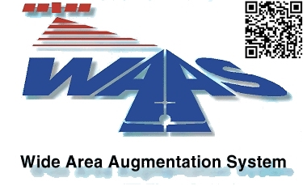]
Scan QRCode to follow along on you mobile device<br>
http://csherrell.github.io/GPS-WAAS-Introduction/GPS-WAAS-Introduction-Short.html  
"p" to toggle notes

???

When the presentation is going:
* 'p' puts you in presenter mode which has notes or a place to add notes.
* 'c' will clone the screen so that you can put it on another monitor.
* You can print to PDF.


* Navigation
  * Next => Down Arrow Key/Right Arrow Key/Mouse Wheel Down.
  * Previous => Up Arrow Key/Left Arrow Key/Mouse Wheel Up.

---

# Questions to Ponder and Answer

* Why yet another navigation system?
    * What are the benefits over other systems?
* What is WAAS?
* Why can't we just use GPS?
* What does WAAS do, really?
* How does WAAS work?
* Where is WAAS used?

---

# Why GPS and WAAS?

.center[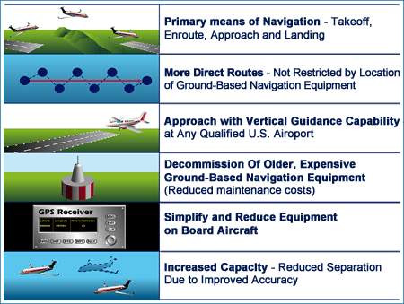]

???

* **Primary Means of Navigation** - Takeoff, Enroute, Approach and Landing
* **More Direct Routes** - Not Restricted by Location of Ground-Based Navigation Equipment
* **Approach with Vertical Guidance Capability** at Any Qualified U.S. Airport
* **Decommission of Older, Expensive Ground-Based Navigation Equipment** - Reduced Maintenance Costs
* **Simplify and Reduce Equipment on Board Aircraft**
* **Increase Capacity** - Reduced Separation Due to Improved Accuracy

There is a picturized list of benefits under "Why GPS and WAAS," which is a repeating slide.

* The flow is talk about first two point:
  * Primary Means of Navigation - Takeoff, Enroute, Approach and Landing
  * More Direct Routes - Not Restricted by Location of Ground-Based Navigation Equipment
* Next Slide
  * Victor airways are not direct
* Next
  * Approach with Vertical Guidance Capability at Any Qualified U.S. Airport
* Next
  * Approach/Departure with an example of a place that it's hard to have infrastructure.
* Next
  * Decommission of Older, Expensive Ground-Based Navigation Equipment - Reduced Maintenance Costs
* Next
  * Kotzebue, AK VOR
* Next
  * Simplify and Reduce Equipment on Board Aircraft
    Increase Capacity - Reduced Separation Due to Improved Accuracy
* Next and continue on.


---

# Why GPS and WAAS?
* Victor airways are not direct

.center[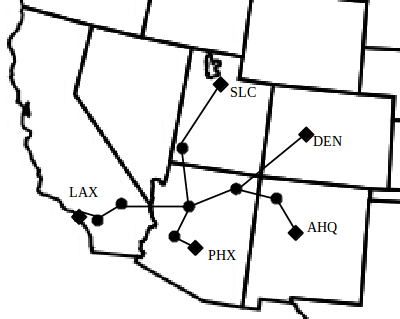]

???

# Notes:

---

# Why GPS and WAAS?

.center[]

---

# Kodiak, Alaska
Runway 25 Centerline (from Alaska Air)

.center[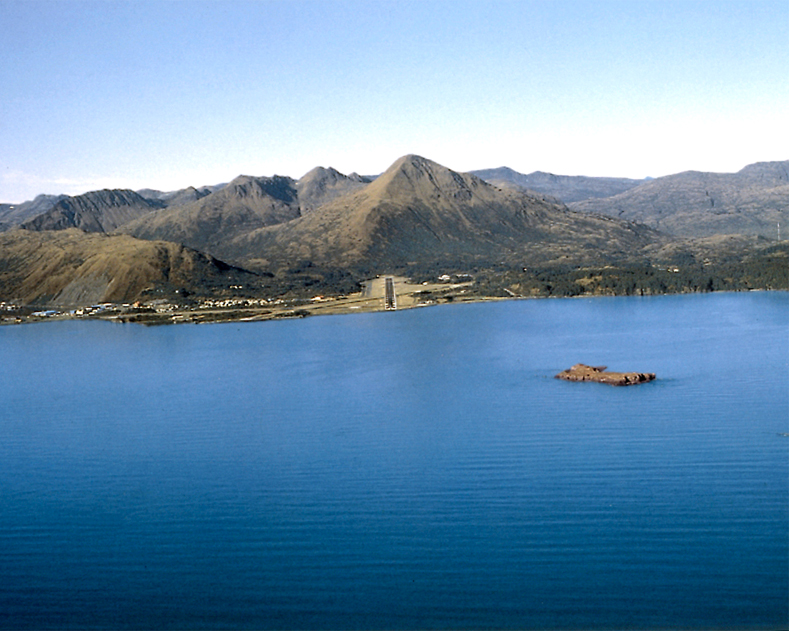]

Decision Height Determined by Missed Approach Missed Approach Is Climbing Left Hand Turn

???

# Notes:

The approach at Kodiak, Alaska is straight into the base of a mountain. There is a missed approach route that is a climbing left hand turn through the valley of two mountain ranges. WAAS can provide the approach and missed approach vectors without any infrastructure at that facility.

---

# Why GPS and WAAS?

.center[]

---

# Kotzebue, VOR
.center[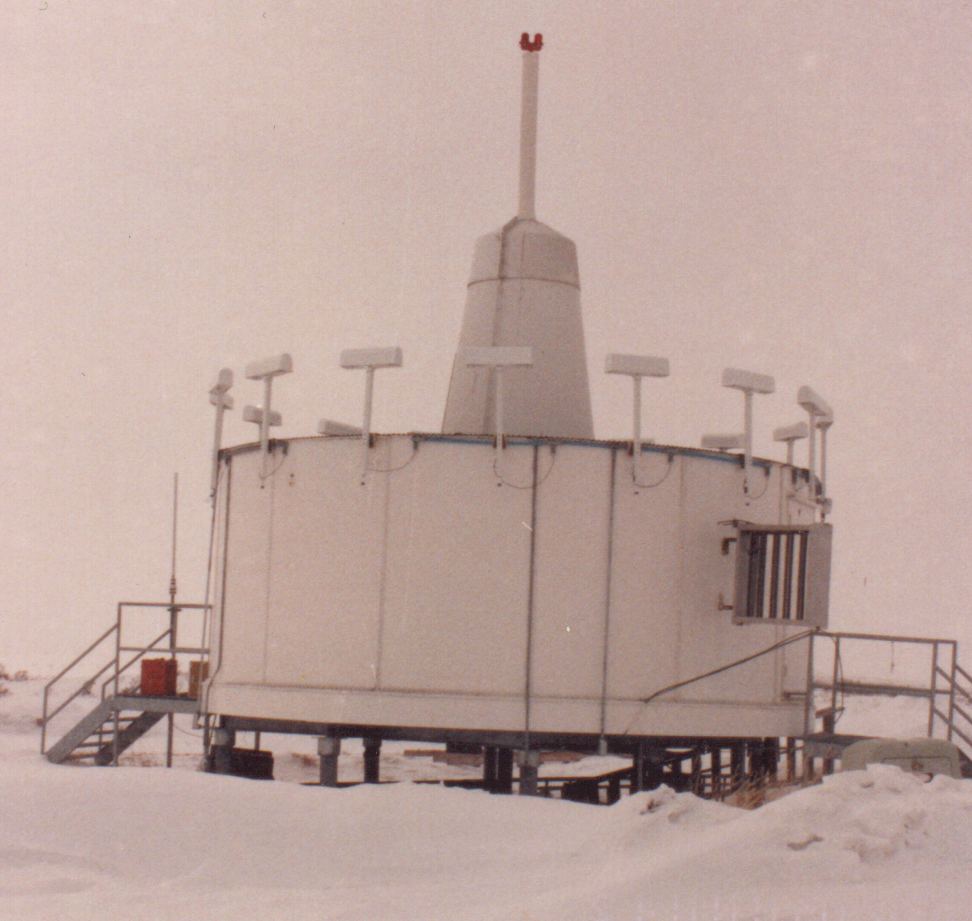]

???

# Notes:

WAAS has redundancy build into every subsystem. Unlike many other ground based Navigational Aids a loss of a subsystem does not mean a loss of WAAS service.  If a VOR or ILS goes down then service in that area is lost until the navaid is restored.  This means that field maintainers may need to be out in the field in adverse weather conditions to restore service.  Though it's not optimal WAAS can run in a degraded state until conditions are suitable for the restoration.


---

# Why GPS and WAAS?

.center[]

---

# What is WAAS?

* Space Based Differential GPS System
    * Detects and corrects GPS errors
    * Monitors and corrects for ionospheric delay
    * Provides additional ranging source for improved availability of navigation services
* Augments GPS and improves:
    * Accuracy
    * Integrity
    * Availability
* At its core WAAS is a realtime sensor network

---

# Why can't we just use GPS?

* Using the distance measurement from three different satellites, the user's position may be at two points of the intersections of three spheres.

.center[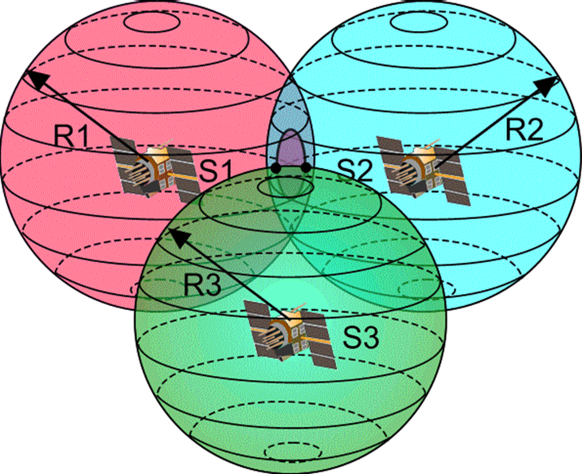]

---

# Ionospheric Delay
* GPS signal isn’t traveling in a straight line through a vacuum
* Ionosphere’s electron content causes a curved path and a propagation delay
* Causes a range error because signal takes longer to arrive
* Can be determined by measuring two different freq L1 and L2
* “Codeless” receivers can measure Ionospheric delay without knowledge of the Y code

.center[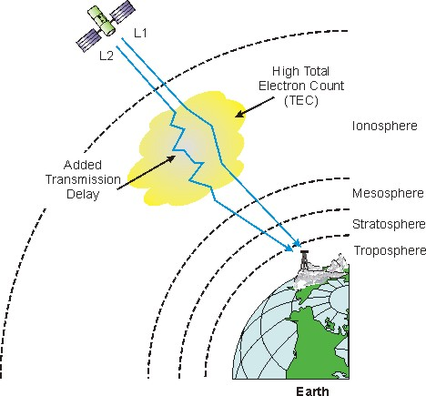]

---

# GPS Error Sources (budget)

| Type of Error | Definition                                  | Amount        |
|---------------|---------------------------------------------|---------------|
| Clock         | Drift, short-term and long-term, that prevents satellite broadcasts from being perfectly synchronized | 3 meters     |
| Ephemeris     | Error in measurement and calculation of satellite’s orbit | 4 meters     |
| Troposphere   | Effects of lower (ground to 8-13 km) atmosphere’s temperature, pressure, and humidity on signal propagation | 2.4-25 meters|
| Ionosphere    | Effect of upper (50 km to 500 km) atmosphere’s free electrons on signal propagation | 10-30 meters |
| Multipath     | Error caused by signals reflected from surfaces near the receiver’s antenna (such as buildings); these reflections interfere with or are mistaken for the primary signal | 2-100 meters |

---

# What does WAAS do, really?
## GPS Protection and Alarm

.center[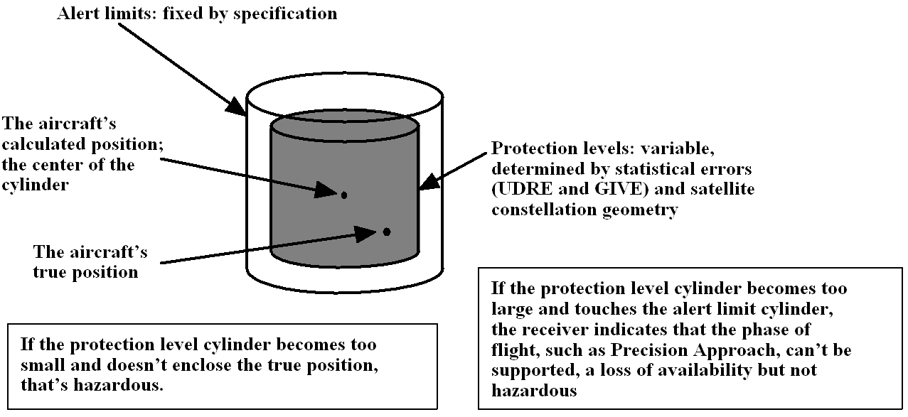]

---

# How does WAAS work?

.center[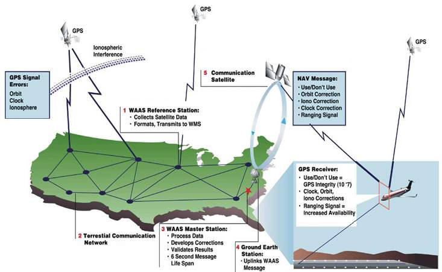]

---

# WAAS Architecture
.center[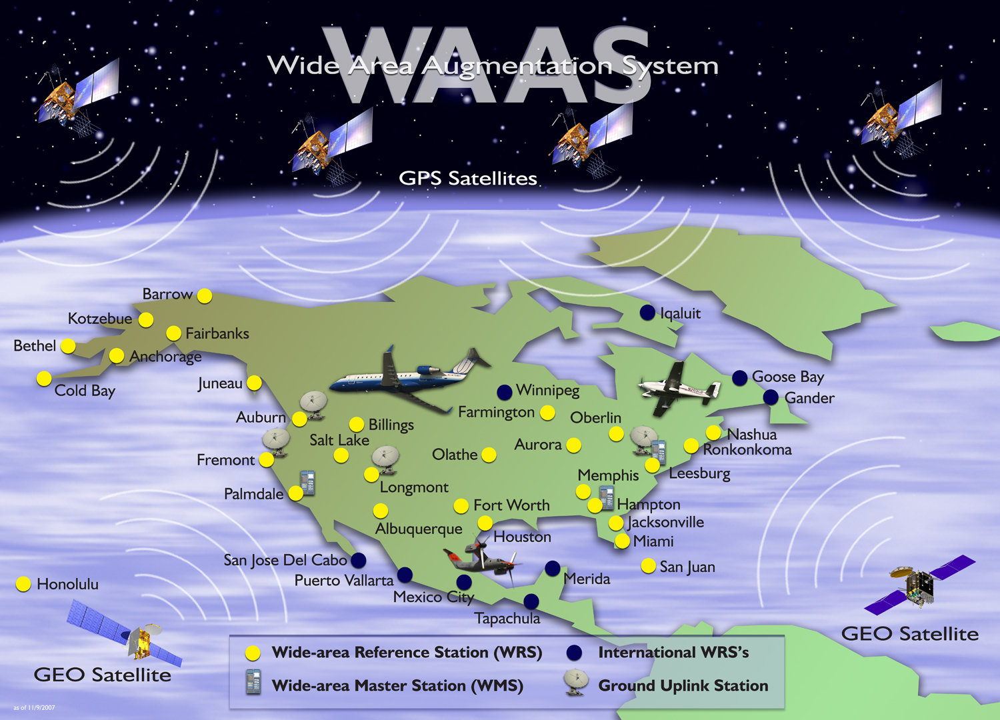]

---

# WAAS GEO Footprint
.center[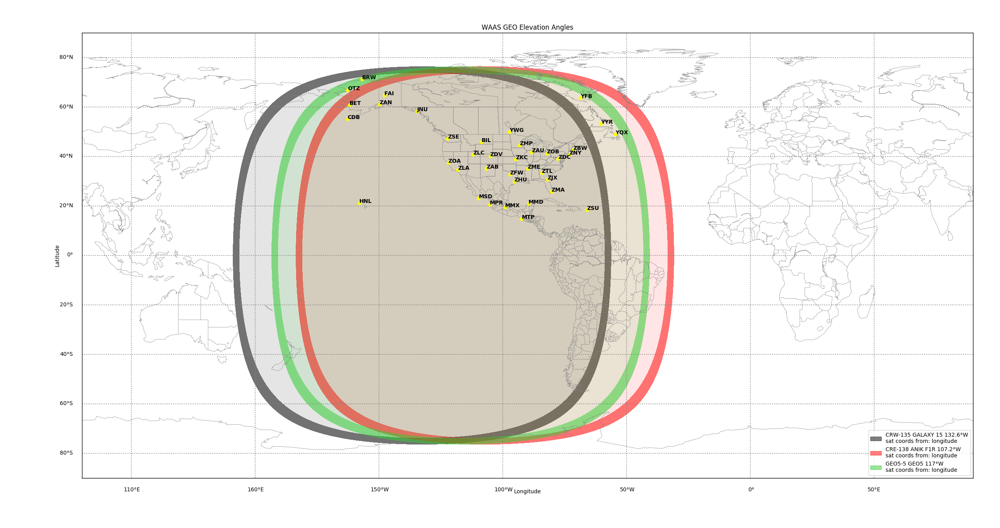]

---

# Where is WAAS used?
* As of May 26, 2016
* Test
    * There are 3,678 WAAS Localizer Performance with Vertical guidance (LPV) approach procedures serving 1790 airports.
    * 1041 of these airports are Non-ILS airports.
    * Currently, there are also 609 Localizer Performance (LP) approach procedures in the U.S. serving 452 airports.

.center[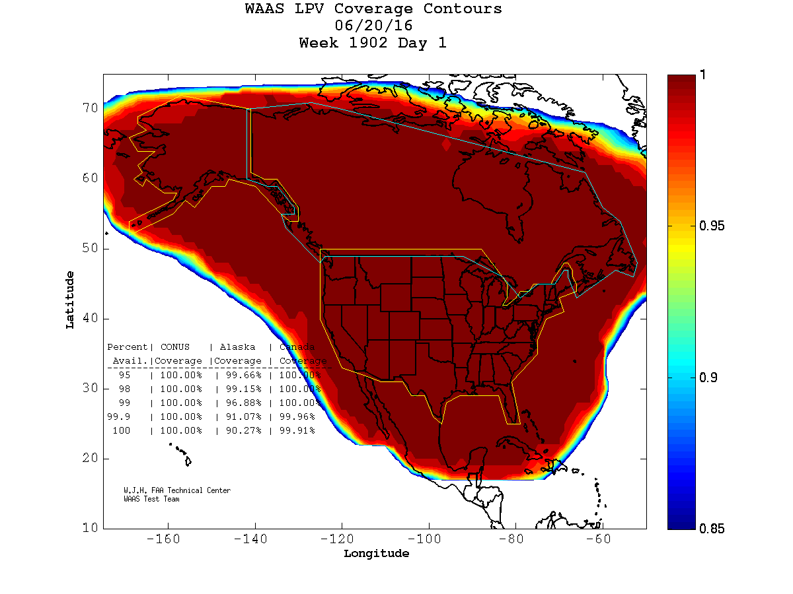 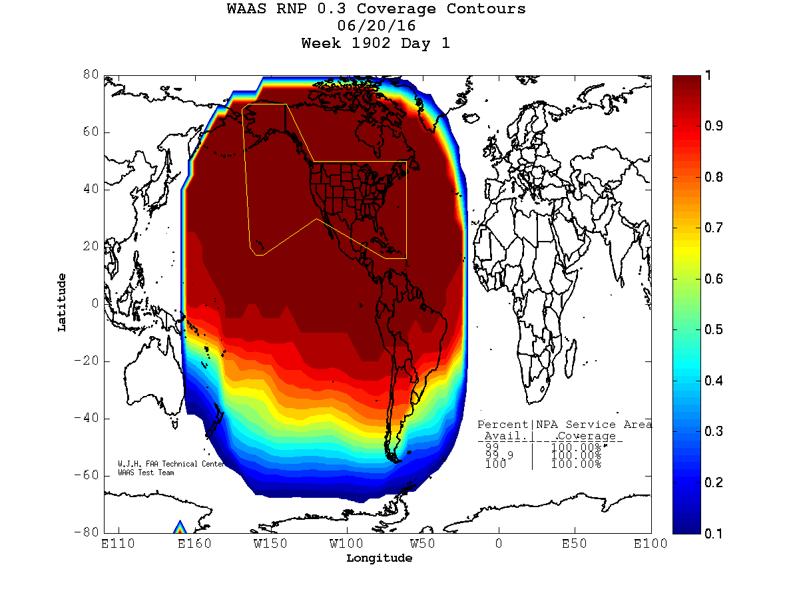]

---

# .center[Questions?]
.center[]

* Presentation done using Markdown + remark.js + GitHub Pages
    * https://en.wikipedia.org/wiki/Markdown
    * http://remarkjs.com/
    * https://pages.github.com/
* This presentation:
    * http://csherrell.github.io/GPS-WAAS-Introduction/GPS-WAAS-Introduction-Short.html
* Source Code
    * http://github.com/csherrell/GPS-WAAS-Introduction.git
    * Switch to gh-pages branch

```


```
