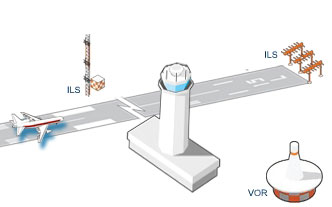
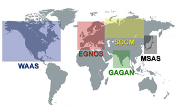
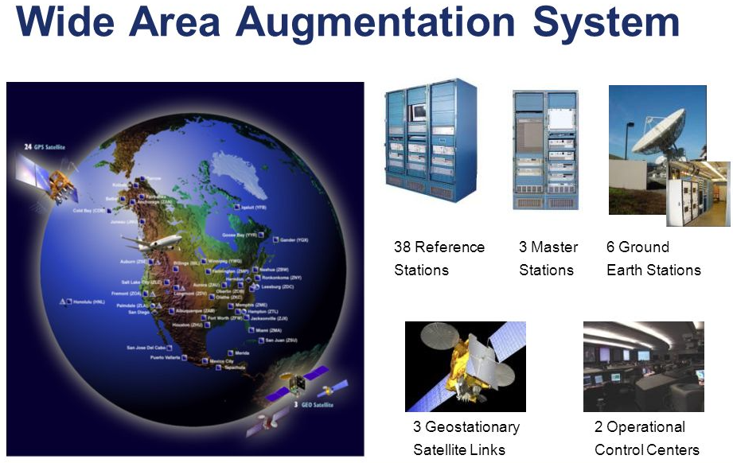

# Why WAAS?
The purpose of The Wide Area Augmentation System is to ensure GPS is a viable means of En Route Navigation, approach, landing and departure for airborne users.

What separates the Wide Area Augmentation System from other navigation aids is that it is space based and provides information to airborne users from 3 GEO Stationary Satellites and not from the ground like others. From these satellites the WAAS signal is viewable throughout nearly the entire wester hemisphere.

WAAS ensures GPS viability for airborne users by increasing the accuracy, availability and integrity of GPS. Accuracy is improved by detecting the errors associated with each GPS satellite and proving a correction for each. The accuracy is further improved by adding a geographical based correction to account for the errors caused to the GPS Radio Frequency signal's propagation delayed through the ionosphere. WAAS improves GPS availability by having each GEO Satellite also provide a ranging source to airborne users that is the same as GPS. This augments GPS in the case of a GPS satellite outages or poor satellite geometry. Last WAAS adds integrity to GPS by monitoring a range of performance issues and sending information to airborne equipment to remove faulty satellites or to reduce availability of GPS in a geographic area due to ionospheric threats. WAAS has several different operational service types with the most stringent being LPVs which provide similar level of service to Category I ILS.

![alt text =0.005x][LPV-Coverage]

# What is WAAS?
The Wide Area Augmentation System is a differential GPS System that provides differential corrections and integrity information about GPS to airborne users. Specifically WAAS is a Space Based Augmentation System that provides corrections from a satellite and not from the ground like other differential correction systems.  Having a space based transmitter gives WAAS a very large coverage area and is not limited by structures, ground terrain, and line of site issues as is other ground base systems. It is intended to enable aircraft to rely on GPS for all phases of flight, including precision approaches to any airport within its coverage area.  

# Why can't we use GPS?
* Ionospheric disturbances
* Clock Drift
* Satellite Orbit errors
* Poor Accuracy
* GPS has to much uncertainty to meet accuracy, integrity and availability requirements for precision approach

# Why another landing system?
The predominate ground bases navigation aids are:
* VHF Omnidirectional Range (VOR) for En Route
* Instrument Landing System (ILS) for approach and landing

The key advantages WAAS has over VORs is aircraft can fly direct routes and WAAS does not need the extensive ground based equipment.

Benefits over ILS are:
* Less ground bases infrastructure
* More precision approaches
* Decommissioning of Category I ILS

With WAAS and along with the other SBAS systems there is a worldwide global navigation network.

# How does WAAS work?
At it core WAAS is a sensor network where the sensor is a GPS antenna and receiver. WAAS tracks all GPS satellites in view at 38 locations ranging from Barrow, AK to Tapachula, Mexico and from Honolulu, HA to Gander, Canada. The reference stations have precisely surveyed GPS antennas and highly accurate GPS receivers.  The stations collect the GPS data and send it to 3 WAAS Master Stations.  These stations calculate the differential GPS solutions for each satellite, the correction for the ionosphere and monitors for any GPS integrity issues. This differential correction and ionosphere information is sent to the ground earth station to be sent to the GEO Satellite. The GEO Satellite broadcast down all this information and at the same time broadcasts a GPS ranging signal. WAAS is monitored 24x7 by WAAS Operations Specialist located in San Diego, CA and Warrenton, VA.

# What is going on at the MMAC?
## Just NASE and My Shadow!
Engineering and Training for the WAAS System is performed at the Mike Monroney Aeronautical Center in Oklahoma City, OK. NASE had a data center located in the National Engineering Test Structure (NETS) (Building 228) at the MMAC.  In this building there are three WAAS Shadow Systems. A Shadow System is a system that is used for testing engineering changes to the WAAS baseline. The three shadows systems are configured in different way to test different aspects of the system. NASE also does software development, performance monitoring and anomaly investigation. Additional the Training Academy also has a Shadow System that is used to train WAAS Maintainers and WAAS Operations Specialist.

[GEO-Coverage]: Images/CRE_CRW_GEO5_cylindrical.png  "GEO Footprint Coverage"

[LPV-Coverage]: http://www.nstb.tc.faa.gov/incoming/NorthAmericaCoverage_LPV.png  "LPV Coverage"
